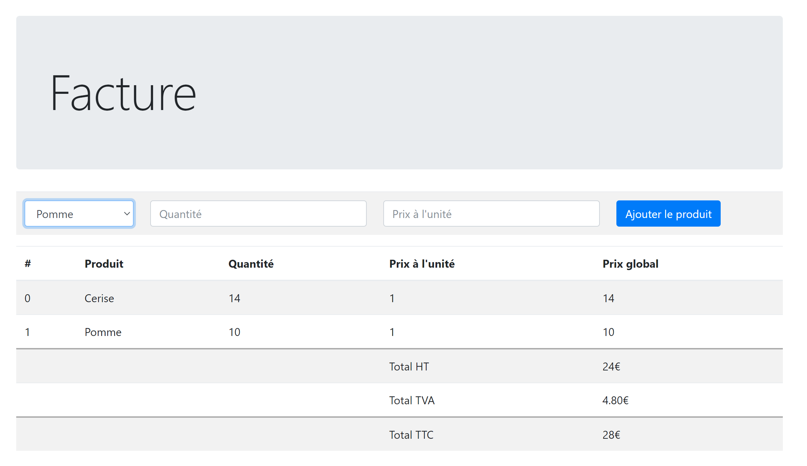

# 13 - TP 06 Factures

démo live en **JavaScript**:
[demo en javascript](https://seven-valley.github.io/formation-php-mai-2024/web/tp13/)

A partir de la maquette :

**ojectif**

- créer depuis phpMyAdmin la base de donnée en copiant les instructions SQL founies dans bdd.sql
- créer un fichier `index.php` contenant la maquête fournie avec `facture-maquette.html`
- créer un fichier `get.php`, celui ci servant à récupérer les données enregistrées depuis la base de données pour les insérer dans `index.php` (utiliser $\_SESSION par exemple)
- créer le fichier `put.php`, celui servant à insérer les données récupérées depuis le formulaire html de `index.php` (mettre à jour la $\_SESSION)
- afficher le total Hors Taxe
- affciher la TVA (20%)
- afficher le total TTC
